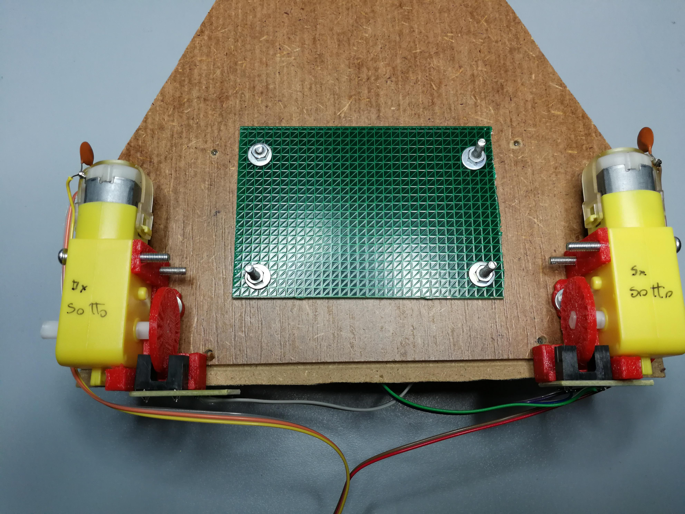
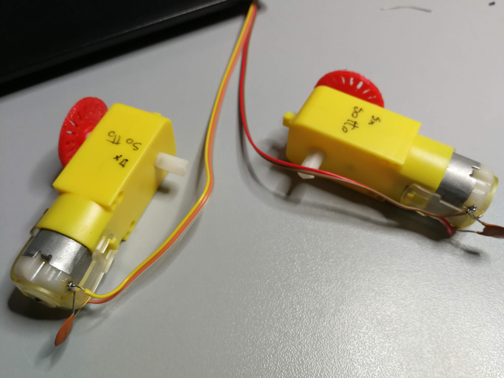

# montaggio ARI_V3

[TOC]

# Tabelle di collegamento connettori

| **J\_ENC** | **filo** | **Jb**asetta End Stop |   |
| --- | --- | --- | --- |
| 1 | Nero | Emitter-Katode | Dx |
| 2 | Bianco | Collector | Dx |
| 3 | Grigio | Anode | Dx |
| 4 | Viola | Emitter-Katode | Sx |
| 5 | Blu | Collector | Sx |
| 6 | verde | Anode | Sx |

 

| CN_FRONT_HEAD |         |                       |
| ------------- | ------- | --------------------- |
| 1             | Marrone | Rosso 5V              |
| 3             | Rosso   | Nero Gnd              |
| 5             | Arancio | Bianco Rx1 (lidar tx) |
| 7             | Giallo  | Verde Tx1 (lidar rx)  |
| 2             | Viola   | IR rx pin             |
| 4             | Grigio  | Nc                    |
| 6             | Bianco  | Led pointer           |
| 8             | Nero    | 3V3 IR power supply   |

# Collegamento motori

Per il significato di sotto e sopra e destro sinistro fare riferimento all'immagine di montaggio. 

**1) Notare il nottolino giallo rivolto verso l'interno**
**2) Dx e Sx sono riferiti al robot in posizione di lavoro con la punta in avanti. Nella foto c'è la vista da sotto e dx e sx sono quindi invertite.**

| MOTORS |         |          |
| ------ | ------- | -------- |
| 1      | Marrone | Sotto sx |
| 2      | Rosso   | Sopra sx |
| 3      | Arancio | Sopra dx |
| 4      | Giallo  | Sotto dx |

# Sequenza montaggio

Indicare il nottolino che deve stare all&#39;interno

