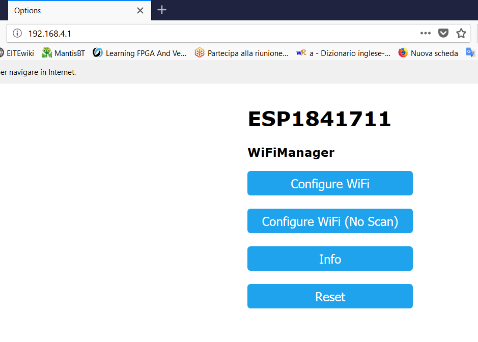
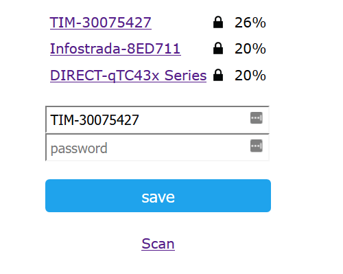

# collegarsi ad ARI_V3

[TOC]

#  

# Come è fatto

ARI è composto da una parte HW e FW, il robot ARI. ARI è composto da una scheda Arduino ATMEGA e da uno shield ARI_V3 fatto da StuffCube stuffcube.wordpress.com. Lo shield porta il controllo dei due motori, un ESP8266 per l'interfaccia col WiFi e funzioni accessori, l'interfaccia elettrica e i connettori verso i sensori ottici degli encoder e alle altre periferiche.

ci sono quindi due FW. Uno per l'ATMega e uno per l'ESP8266 (Wemmos mini D1). Questi si compilano e scaricano con l'ambiente Arduino. Una serie di librerie deve essere installata. elenco librerie ... da fare

Un software su pc è l'interfaccia con ARI. E' un server in python che offre una interfaccia web visualizzabile nel browser. richiede l'installazione di Python3 e di alcune librerie.

# Installazione Python

## Librerie Python

i comandi segunti valgono per Windows e Linux.

utility pip da shell di comando lanciare pip, se non risultasse installato fare

*apt-get install python3_pip*

### modulo Tkinter

il 3.6 va sostituito dalla versione di python installata sul proprio computer, per conoscerla lanciare python3 da riga di comando

*apt-get install python3.6-tk*

### modulo Sympy

*pip3 install sympy*

### modulo Numpy

*pip3 install numpy*

### modulo Cherrypy

*pip3 install cherrypy*

 

##  Configurazione software

lanciare il programma ad Arianna spenta, dopo qualche secondo si aprirà una pagina web con le seguenti opzioni

 ​                   

in alto indica il nome di Arianna che equivale alla configurazione che verrà usata (all'inizio vale 'default')

 

 

## Wifi setting

 

Se rete non è presente o non è stata ancora impostata il led blu sull’ESP lampeggia col periodo di un secondo (05 on, o5 off).
 L’eSP si configura come access point con il nome ESP.. seguito dal suo numero di serie.

Questa rete è aperta, non è necessario user name e password. Una volta collegati avviate un browser che andrà automaticamente alla pagina di configurazione, nel caso non funzione andate all’indirizzo 192.168.4.1

​                   

Scegliendo “Configure WiFi” si ottiene la lista delle reti, selezionatene una, inserite la password e fate Save. Al riavvio si connetterà alla rete scelta.

 

   

 

 

 

# Collegamento da pc

 

ARI_V3\01_pcSoftware\arianna_cli_socket2.0

Avviare Python e aprire il programma “arianna_clisocket.py” 

Appare la CLI.

GUI: da browser inserire l’indirizzo <http://127.0.0.1:8081/ui2>

 